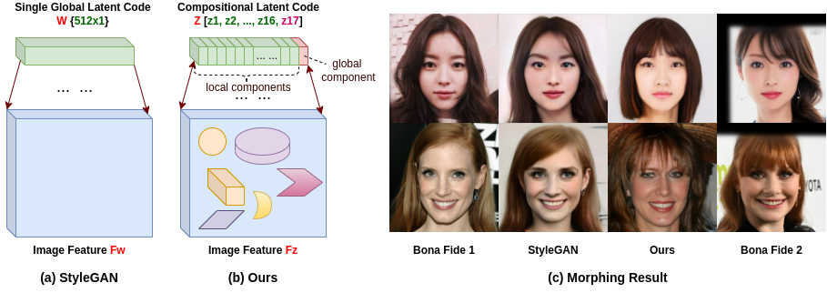
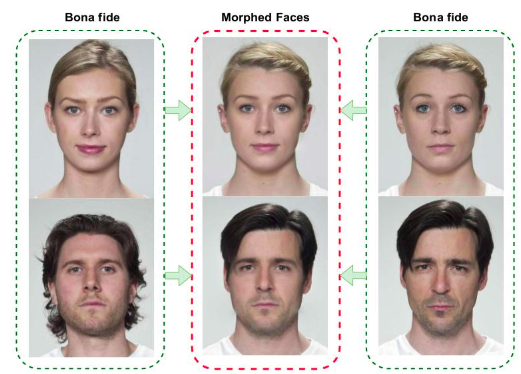
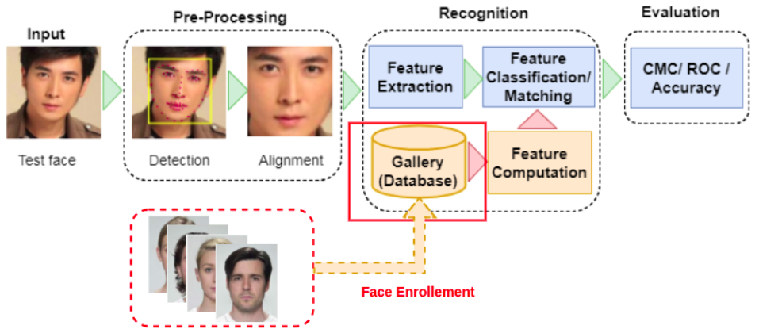
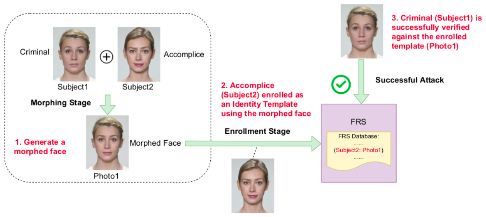
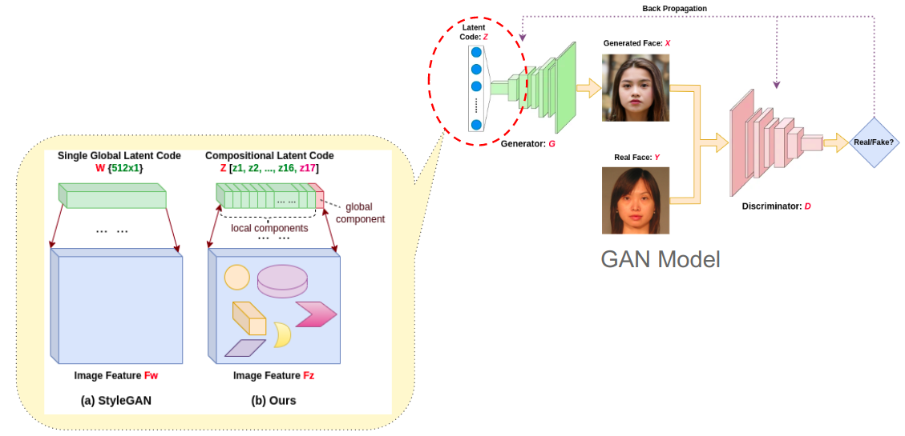
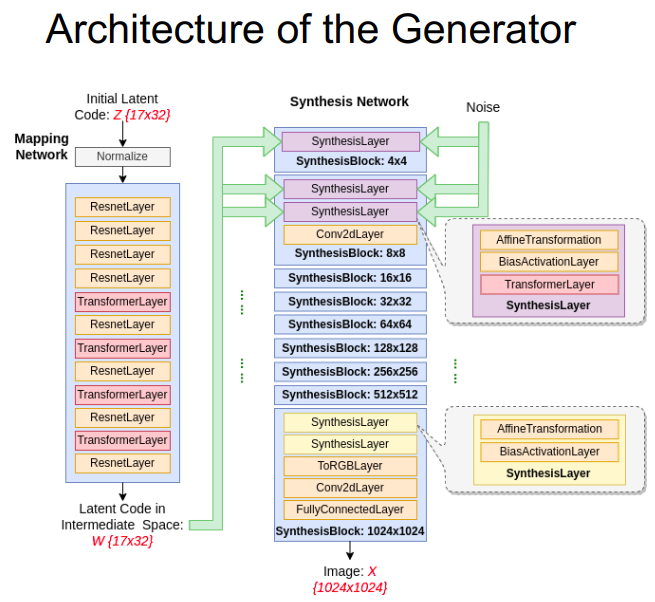
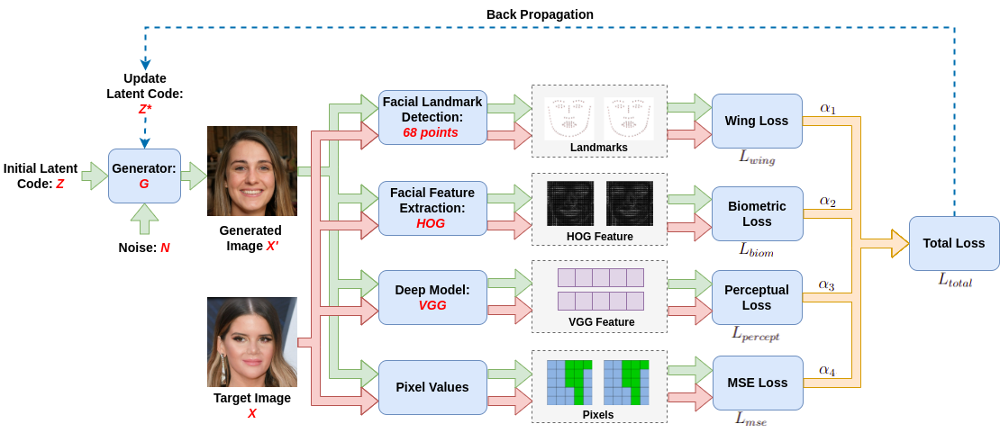
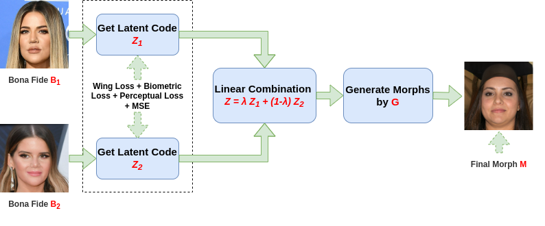
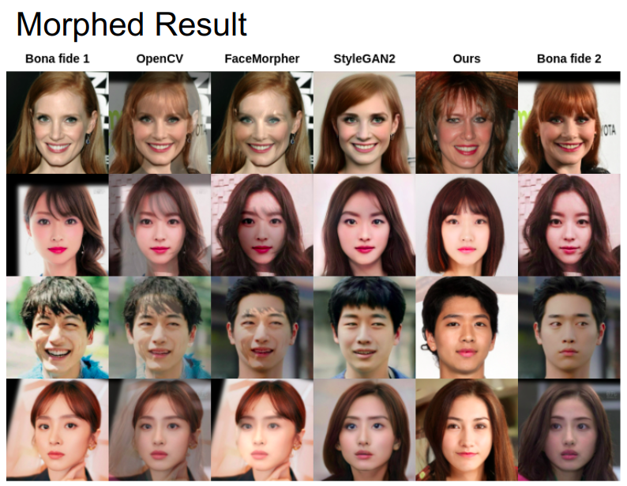
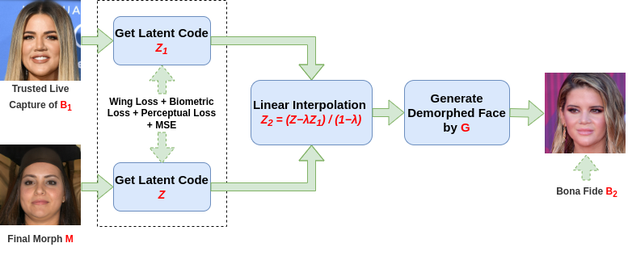

# MorphGANFormer
This is the basic implementation of work 'MorphGANFormer: Transformer-based Face Morphing and De-Morphing'.

### Link: 
[[PDF]](https://arxiv.org/pdf/2302.09404.pdf)
[[Arxiv]](https://arxiv.org/abs/2302.09404)

Our model is based on the paper:  GANformer: Generative Adversarial Transformers 
[[Github]](https://github.com/dorarad/gansformer)
[[Arxiv]](https://arxiv.org/abs/2103.01209)

# Environment
- Python 3.6 or 3.7 are supported.
- Pytorch >= 1.8.
- CUDA 10.0 toolkit and cuDNN 7.5.
- See [`requirements.txt`](requirements.txt) for the required python packages and run `pip install -r requirements.txt` to install them.

# Abstract
* Inspired by GANformer, we introduce a transformer-based face morphing algorithm. 
* Special loss functions are designed to support the optimization of face morphing process. 
* We extend the study of transformer-based face morphing to demorphing by presenting an effective defense strategy with access to a reference image using the same generator of MorphGANFormer. 

# Introduction
With the fast development of deep learning techniques, face recognition systems (FRS) have emerged as a popular technique for person identification and verification, due to the ease of capturing face biometrics. In our daily lives, one of the most relevant applications is the Automatic Border Control System, which can rapidly verify a person’s identity with his electronic machine-readable travel document by comparing the face image of the traveler with a reference in the database. 

Although FRS with high accuracy can effectively distinguish an individual from others, it is vulnerable to adversarial attacks. 
Recent research found that attacks based on morphed faces pose a severe security risk in various applications, since the morphed face images are realistic enough to fool human examiners. 

This Fig. presents some morphed examples in the middle column which are generated by combining two bona fide faces in the first and third columns. One can see the morphed faces show strong visual resemblance to both bona fide faces.

# What’s Morphing Attack
Morphing attacks try to interfere with the operation of the FRS by presenting an attack at the time of enrollment. As shown in the fig., when people register in FRS system, the morphed photo is uploaded to the system.

# Attack Procedure

The idea is that: 
* First, a morphed face image is generated by combining two real face images belonged to the criminal and accomplice. 
* The morphed face resembles the biometric information of the real individuals in image and feature domain.
* And then the morphed image is enrolled as an identity template of the accomplice in FRS.
* In a successful attack, the criminal contributing to the morphed image will be successfully verified against that single enrolled template. 
* The system will treated the criminal as the accomplice, and let him /her pass.
* A wanted criminal is easy to obtain a legal electronic machine-readable travel document (eMRTD) by morphing his/her facial image with an accomplice who can use the morphed face to apply for a passport.
* This attack means the basic principle of biometrics, the unique link between individuals and their biometric reference data, is violated. 

# MorphGANFormer Procedure

Morphing attack means to generate morphed faces. Existing methods are divided into landmarked based and deep learning based. A famous deep learning based method is StyleGAN which generates morphed faces by interpolating latent code.

In StyleGAN, 
* The generator model uses CNN architecture.
* The latent space is monolithic.
* It uses a single global style latent code to modulate the whole scene uniformly in one direction.
  

Our method is based on a model called GANformer:
* The generator uses transformer architecture.
* The latent space is compositional.
* The latent code is composed of multiple local style latent components and one global component.
* Different components can impact different regions in the image.
* This design allows for a spatially finer control over the generation process bidirectionally, Which means it can propagate information between latents and features in both directions.

# Face Latent code Optimization

This pipeline shows how to obtain the latent code of a given image.

The basic idea is: With an initial latent code as starting, the model tries to find an optimized latent code that can maximize the similarity between the target image and the generated image. 

In our work, we employ 4 types of loss functions to measure the similarity.
* Wing Loss: 
originally proposed for facial landmark localization
to improve the capability of the model for small and medium range errors of landmarks of the faces.
* Biometric Loss:
This loss is used to handle the biometric aspect of generated face 
and make sure the generated face is related to the target face
It is obtained by calculating face matching distance
* Perceptual Loss:
measure the high-level similarity between images perceptually
by the covariance statistics of the extracted features by VGG model
* Pixel-wise Mean Square Error:
Pixel-level loss

# Face Morphing Pipeline

# Face De-Morphing Pipeline

# Content
This repository contains the implementation of:
* MorphGANFormer 
* Morphing and De-morphing
