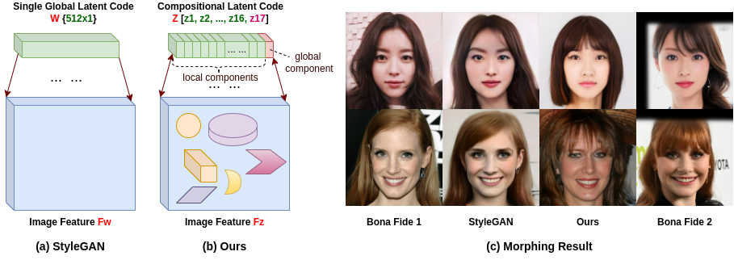

# MorphGANformer

This is the offcial implementation of paper 'MorphGANFormer: Transformer-based Face Morphing and De-Morphing'.
Code will be coming soon.

# Introduction
Inspired by GANformer, we introduce a transformer-based face morphing algorithm. Special loss functions are designed to support the optimization of
face morphing process. We extend the study of transformer-based face morphing to demorphing by presenting an effective defense strategy with access to a reference image using the same generator of MorphGANFormer. Such demorphing is conceptually similar to unmixing of hyperspectral images but operates in the latent (instead of pixel) space. 

# Environment

